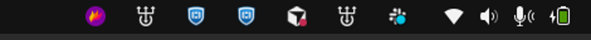
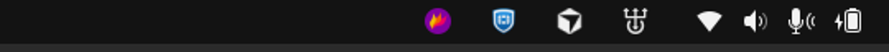

# Hide Slack Icon

GNOME Shell extension that hides **only** the Slack icon on the top panel. Other AppIndicators stay visible, and Slack keeps running from the Dock.

[](/LICENSE)
[](https://extensions.gnome.org/extension/10959/hide-slack-icon/)

**Before** (Slack tray icon visible):



**After** (Slack hidden, everything else unchanged):



## Installation

### GNOME Extensions

[](https://extensions.gnome.org/extension/10959/hide-slack-icon/)

### Manual

```bash
git clone https://github.com/felipevolpatto/hide-slack-icon.git
cd hide-slack-icon
make install
```

Then restart GNOME Shell (X11: `Alt+F2`, type `r`; Wayland: log out / log in) and run `make enable`.

Uninstall: `make uninstall`.

## Compatibility

GNOME Shell 42–47 (Ubuntu 22.04 and newer).

## Development

```bash
make test      # matcher tests (gjs)
make install   # copy into ~/.local/share/gnome-shell/extensions/
```

Shared logic lives in `lib/hideSlackCore.js` (GNOME 42–44) and `lib/hideSlackCore.esm.js` (GNOME 45+). Keep them in sync.

## Contributions

Issues and pull requests are welcome. Open an issue first if you plan a larger change.
